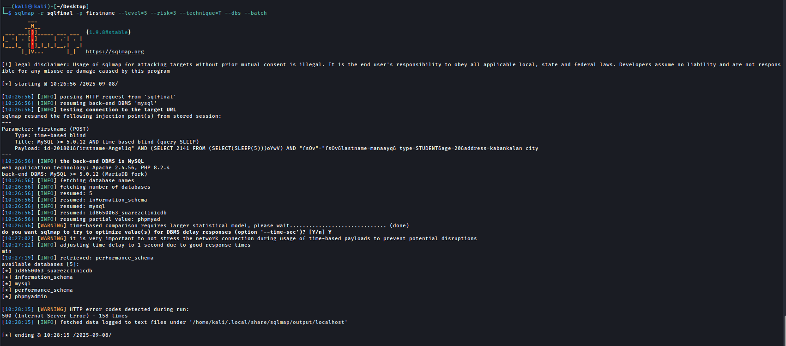
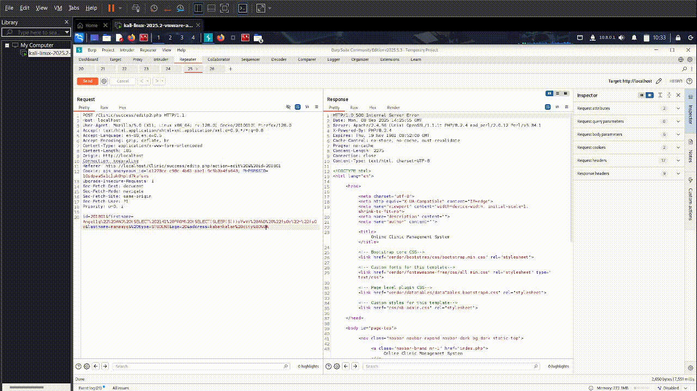
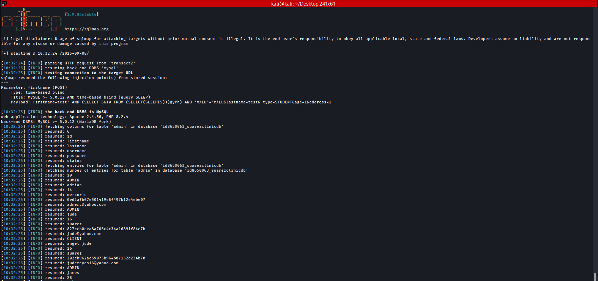

# Online-Clinic-Management-System Time-Based Blind SQLi PoC

|             | Details |
|-------------------|---------|
| **Vulnerability Type** | Time-Based Blind SQL Injection |
| **Affected File** | `editp2.php` |
| **Parameter** | `firstname (POST)` |
| **Vendor** | [itsourcecode](https://itsourcecode.com/) |
| **Product** | [Online Clinic Management System v1](https://itsourcecode.com/free-projects/php-project/online-clinic-management-system-php-projects-source-code/) |
| **Softlink** | https://itsourcecode.com/free-projects/php-project/online-clinic-management-system-php-projects-source-code/ |

### Summary
-  The Online Clinic Management System is vulnerable to time-based blind SQL Injection in the ``editp2.php`` script. This flaw enables attackers to manipulate SQL queries and exfiltrate sensitive data (e.g., administrative credentials), which can lead to complete system compromise.


### Vulnerable Code
```php
$zz = $_POST['id'];
$fname = $_POST['firstname'];
$lname = $_POST['lastname'];
$type = $_POST['type'];
$age = $_POST['age'];
$address = $_POST['address'];

$query = 'UPDATE patients set fname ="'.$fname.'",
    lname ="'.$lname.'", patient_type="'.$type.'",
    age="'.$age.'",address="'.$address.'" 
    WHERE patient_id ="'.$zz.'"';

$result = mysqli_query($db, $query) or die(mysqli_error($db));

```
-  User-supplied data ``($_POST)`` is directly concatenated into the SQL string.
-  No escaping, sanitization, or prepared statements are used.
-  This allows attackers to inject arbitrary SQL code through parameters like ``firstname``.

**Evidence:** *sqlmap output*



---

### Proof of Concept
### 1. Request in Burp
-    A normal edit to the patient details was intercepted with Burp Suite.
-    The raw request was saved into a file for sqlmap testing.
  


### 2. ``sqlmap`` dump
-   Run sqlmap using the Burp request file
-   sqlmap confirmed the injection point.



---

## Result:
-  The server delayed its response by 5 seconds, confirming successful time-based injection.
-  Sqlmap was able to enumerate the database ``(id8650063_suarezclinicdb)`` and dump the useraccounts table.
